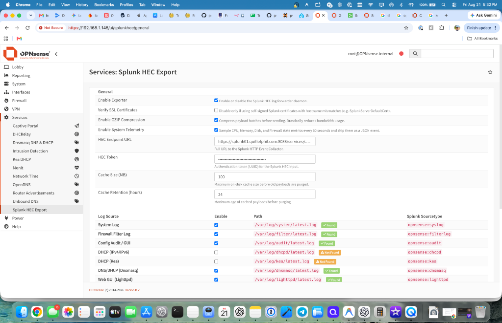
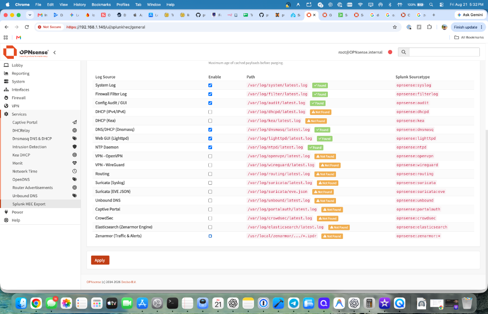
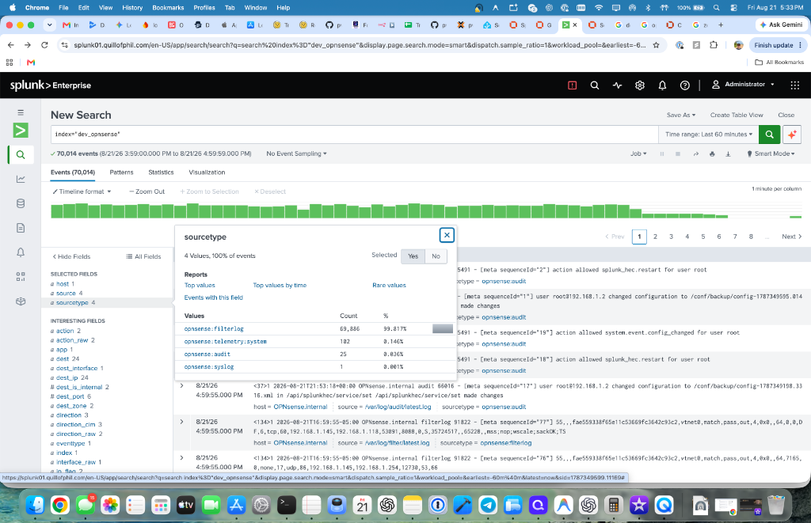

# OPNsense Splunk HEC Plugin (`os-splunk-hec`)

Plugin for sending OPNsense logs to Splunk via HTTP Event Collector (HEC).

## Goals

- Native OPNsense plugin
- Configurable from WebGUI
- Multiple log sources
- **Dropped**: HEC RAW support (Focusing exclusively on structured HEC Event/JSON payloads for better parsing)
- Compression support (GZIP)
- Local retry and caching
- Single service architecture
- System Hardware & Firewall Telemetry (CPU, Memory, Disk, PF states)
- Zenarmor Elasticsearch IPDR parsing

---

## Screenshots







---

## Installation & Quick-Start

### Prerequisites

- OPNsense 26.7 or later
- A Splunk instance with an HTTP Event Collector (HEC) input configured
  - Note the **HEC token** (UUID format) and the **endpoint URL**
    (e.g. `https://splunk.example.com:8088/services/collector`)

### Install the Plugin

```bash
opnsense-pkg install os-splunk-hec
```

After installation, reload the UI or run:

```bash
opnsense-reloadall
```

### Configure via WebGUI

1. Navigate to **System → Settings → Splunk HEC**.
2. **Enable Exporter** – check the box.
3. **HEC Endpoint URL** – enter the full URL to your Splunk HEC endpoint
   (e.g. `https://splunk.example.com:8088/services/collector`).
4. **HEC Token** – paste the token from your Splunk HEC input.
5. **Log Files** – comma-separated list of log files to forward
   (default: `/var/log/system.log,/var/log/filter.log`).
6. **Cache Size (MB)** – maximum size for the on-disk payload cache (default: 100 MB).
7. **Cache Retention (hours)** – how long cached payloads are kept before purging (default: 24 hours).
8. Click **Save & Apply**.

### Verify

1. **Check the service is running:**

   ```bash
   service splunk_hec status
   # or from the WebGUI: the status badge next to the page title shows "Running"
   ```

2. **Generate a test log line:**

   ```bash
   logger "test-splunk-phase1"
   ```

3. **Confirm delivery in the daemon log:**

   ```bash
   tail -f /var/log/splunk_hec.log
   # Look for: INFO  /var/log/system.log: forwarded 1 line(s).
   ```

4. **Search in Splunk:**

   ```spl
   index=* sourcetype=* "test-splunk-phase1"
   ```

### Verify Cache Fallback

1. Set the **HEC Endpoint URL** to an unreachable address (e.g. `https://192.0.2.1:8088/services/collector`).
2. Generate some log activity.
3. Confirm payloads are cached:

   ```bash
   cat /var/run/splunk_hec_cache.log
   ```

4. Restore the correct endpoint URL and click **Save & Apply**.
5. On the next daemon run, cached payloads will be flushed – verify in
   `/var/log/splunk_hec.log` (look for `Flushed N cached payload(s).`).

---

## Plugin Architecture

```
src/opnsense/
├── service/templates/OPNsense/SplunkHEC/
│   ├── splunk_hec.xml              # configd service definition
│   └── actions.d/
│       └── actions_splunkhec.conf  # configd actions (start/stop/restart/status)
├── scripts/OPNsense/SplunkHEC/
│   └── Exporter.php               # Daemon script (log reader + HEC forwarder)
└── mvc/app/
    ├── models/OPNsense/SplunkHEC/
    │   ├── SplunkHEC.xml          # Configuration model (fields + validation)
    │   ├── Menu/Menu.xml          # WebGUI menu entry
    │   └── ACL/ACL.xml            # Access control definition
    ├── controllers/OPNsense/SplunkHEC/
    │   ├── GeneralController.php  # UI page controller
    │   └── Api/
    │       └── ServiceController.php  # REST API (get/set/status)
    └── views/OPNsense/SplunkHEC/
        └── index.volt             # Settings page template
```

### Runtime Flow

1. The **configd** service framework invokes `Exporter.php` on a periodic timer.
2. The script reads its INI config from `/var/etc/splunk_hec.conf`.
3. For each configured log file, it tracks the inode and byte offset in
   `/var/run/splunk_hec_state.json` to survive log rotation.
4. New lines are packaged as JSON and POSTed to the Splunk HEC endpoint.
5. On HTTP failure, payloads are appended to `/var/run/splunk_hec_cache.log`.
6. On the next successful run, cached payloads are flushed first.

### Key Files at Runtime

| Path | Purpose |
|------|---------|
| `/var/etc/splunk_hec.conf` | INI config written by the API controller |
| `/var/run/splunk_hec_state.json` | File offset tracking (survives rotation) |
| `/var/run/splunk_hec_cache.log` | Failed payload cache (on-disk queue) |
| `/var/log/splunk_hec.log` | Daemon's own log output |

---

## Manual Test Checklist (Phase I)

Run on a test OPNsense VM (version 26.7):

- [ ] Install the plugin and reload the UI.
- [ ] Open the Splunk HEC settings page (**System → Settings → Splunk HEC**).
- [ ] Fill a dummy HEC endpoint (e.g. `https://httpbin.org/status/200`) and a fake token; enable the service.
- [ ] Verify the daemon is running: `service splunk_hec status`.
- [ ] Generate a test line: `logger test-splunk-phase1`.
- [ ] Check `/var/log/splunk_hec.log` for `POST … 200`.
- [ ] Point the endpoint to a non-responding address; confirm payloads appear in `/var/run/splunk_hec_cache.log`.
- [ ] Re-enable a valid endpoint and verify cached lines are flushed.
- [ ] Look for the flushed events in Splunk.

---

## Roadmap

- **Phase I** *(Completed)*: Core daemon, base log forwarding, WebGUI settings.
- **Phase II** *(Completed)*: Add-on log source toggles (e.g. dhcpd, suricata, ntpd), dynamic GUI disk-checking, and round-robin stream multiplexing.
- **Phase III** *(Completed)*: Zenarmor deep-packet-inspection IPDR parser integration and System Telemetry generation.

---

## License

BSD-2-Clause
